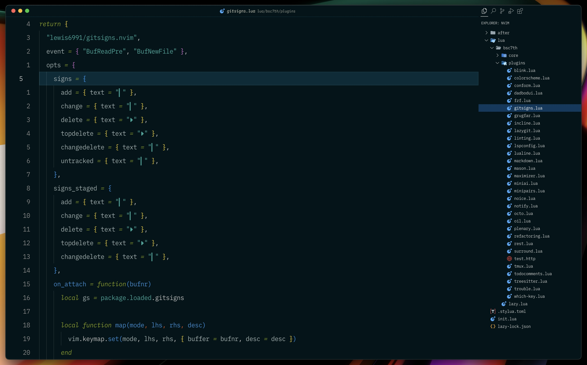

# Exploring VSCode

## [Igor Babko](https://github.com/IgorBabko/)

Recently, I began exploring other editors like **[VSCode](https://code.visualstudio.com/)** to see what useful features I could bring into my Neovim setup. I was curious to find out how customizable VSCode is, and to my surprise, it's quite flexible.
I’ve been learning how to tweak it much like Neovim, setting up my key mappings (since I mostly navigate with the keyboard and rarely use the trackpad), customizing the interface, and making it feel like home.
My current VSCode configuration is based on a fantastic [YouTube video by Igor Babko](https://www.youtube.com/watch?v=VmFOsK7IhI4). If you're a VSCode user and want to tailor it to feel more like Neovim, I highly recommend checking out his guide.

Happy VSCoding!

## Archived

This repository is no longer maintained. I customized VS Code briefly and am no longer using it. The content is preserved for reference only.
